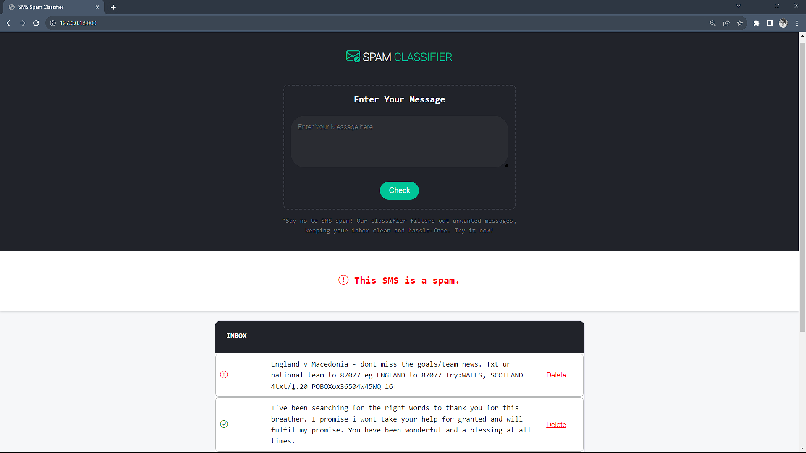

# SMS Spam Classifier

SMS Spam Classifier is a simple Flask-based web application that uses a machine learning model to classify SMS messages as either spam or not spam. Users can input a message, and the application will provide a classification result.

## Features

- Text preprocessing to clean and prepare the input message.
- Vectorization of the message using TF-IDF.
- Prediction using a pre-trained machine learning model.
- User-friendly web interface.

## Getting Started

To run this application locally, follow these steps:

1. Clone the repository:

   ```bash
   git clone https://github.com/hariX02/SMS-Spam-Classifier.git
   cd SMS-Spam-Classifier
   ```

2. Install the required Python libraries:

   ```bash
   pip install flask nltk
   ```

3. Run the Flask application:

   ```bash
   python app.py
   ```

4. Open a web browser and go to `http://localhost:5000` to access the application.

### Preview



## Usage

- Enter a text message into the input field.
- Click the "Check" button.
- The application will display whether the message is spam or not.

## Dependencies

- Python
- Flask
- NLTK
- Pickle

## Project Structure

```
SMS-Spam-Classifier/
│
├── app.py   # The main Flask application
│
├── templates/
│   └── index.html        # HTML template for the web interface
│
├── vectorizer.pkl         # Pre-trained TF-IDF vectorizer
│
├── model.pkl              # Pre-trained machine learning model
│
└── README.md              # This README file
│
└── spam-dataset.csv       # SMS Dataset
│
└── Others                 # Assesment Documents and Notebooks 
```
## Dataset Source and Brief Description

**Source**: The SMS Spam Collection dataset is a collection of SMS tagged messages gathered for SMS Spam research. It consists of 5,574 SMS messages in English, each tagged as either "ham" (legitimate) or "spam."

**Content**: The dataset is structured with one message per line, and each line contains two columns:
- `v1`: This column contains the label, which is either "ham" or "spam."
- `v2`: This column contains the raw text of the SMS message.

**Origins of the Dataset**: The SMS Spam Collection dataset has been assembled from various sources available on the internet, which include:

1. **Grumbletext Web Site**: A collection of 425 SMS spam messages was manually extracted from the Grumbletext website. The Grumbletext website is a UK forum where cell phone users publicly discuss SMS spam messages. These messages were identified as spam based on user claims without specific spam reporting.

2. **NUS SMS Corpus (NSC)**: This dataset includes a subset of 3,375 randomly selected "ham" messages from the NUS SMS Corpus (NSC). The NSC is a collection of around 10,000 legitimate messages gathered for research at the Department of Computer Science at the National University of Singapore. The messages mainly originate from Singaporeans and university students who contributed their messages with an awareness of their public availability.

3. **Caroline Tag's PhD Thesis**: The dataset also includes a list of 450 "ham" messages collected from Caroline Tag's PhD Thesis.

**Access to the Dataset**: 
The SMS Spam Collection dataset can be accessed on Kaggle through the following link:
[SMS Spam Collection Dataset on Kaggle](https://www.kaggle.com/datasets/uciml/sms-spam-collection-dataset)

## Contributing

If you would like to contribute to this project, please follow the standard GitHub fork and pull request workflow.

## License

Distributed under the [GNU General Public License v3.0](https://choosealicense.com/licenses/gpl-3.0/). See `LICENSE` for more information.

## Acknowledgments

- [NLTK](https://www.nltk.org/) - Natural Language Toolkit for text processing
- [Scikit-Learn](https://scikit-learn.org/stable/) - Machine learning library for Python
- [Flask](https://flask.palletsprojects.com/) - Web framework for Python

## Contact

For any questions or inquiries, please contact [Hari Haran](mailto:hariharanuv7@gmail.com).

